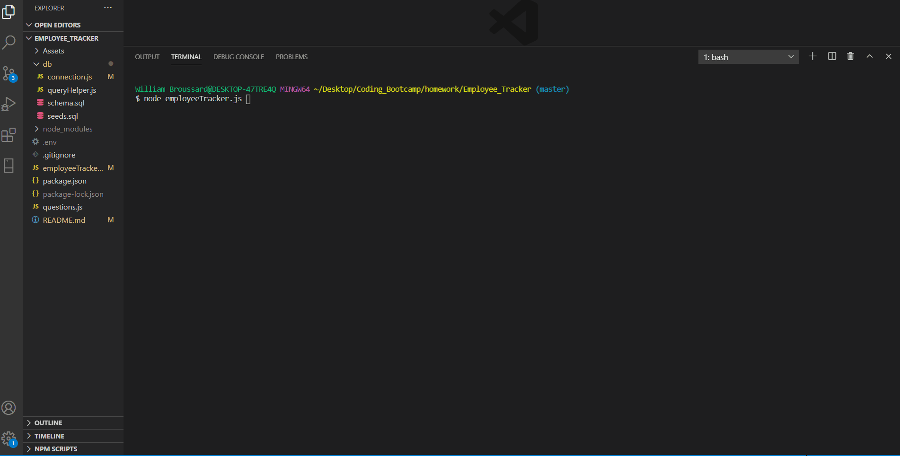

# Employee__Tracker 
## Description

The Employee Tracker is an npm, mysql database powered command line application, that is used to add and check on employees, roles, and their managers for a given company.

This app will launch into a CLI based main menu, where you can view each table in the database. From there the user may add or remove information as they see fit.
It will also give functionality for updating specific parts of your employees, like their current roles, or mangers.
It also gives the ability to check on current budgets alloted for each department based on salaries.

## Table of Contents
* [Installation](#installation)
* [License](#license)
* [Credits](#contributing)
* [Demo](#demo)

## Installation
```
npm install
run schema.sql to set up database
set up .env file
run: node employeeTracker.js
```
## License
MIT
## Contributing
 

[William Broussard](https://github.com/Karsus7)

## Demo

